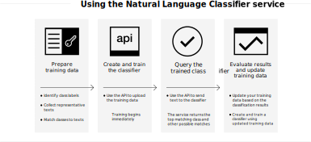

---

copyright:
  years: 2015, 2020
lastupdated: "2020-01-30"

keywords: Use cases,overview

subcollection: natural-language-classifier

---

{:help: data-hd-content-type='help'}
{:support: data-reuse='support'}
{:external: target="_blank" .external}
{:shortdesc: .shortdesc}

# About
{: #about}

{{site.data.keyword.nlclassifierfull}} uses machine learning algorithms to return the top matching predefined classes for short text inputs.
{:shortdesc}

{{site.data.keyword.nlclassifiershort}} can help your application understand the language of short texts and make predictions about how to handle them. A classifier learns from your example data and then can return information for texts that it is not trained on.

## How you use the service
{: #overview-how-to-use}

The following image shows the process of creating and using the classifier:

## Use cases
{: #use-cases}

You can use {{site.data.keyword.nlclassifiershort}} in many different applications and industries. Here are some examples:

- **Banking and finance**: Classify investments, risks, and transactions.
- **Higher Education and Government**: Sort text or documents into categories. Useful for Academia, Law, Non-profit organizations, and other organizations that require classification.
- **E-commerce and Retail**: Help your users choose products by narrowing the choices by theme. Tag products or identify fraudulent items.
- **Services**: Categorize service queries, messages, and responses to help address problems and deploy solutions quicker.
- **Social media**: Organize tweets, email, posts, and shares into categories or themes.
- **Talent solutions**: Analyze resum&eacute;s and applications to derive deeper meaning.

With {{site.data.keyword.nlclassifiershort}}, the data is yours to parse and categorize.

## Supported languages
{: #supported-languages}
{: help}
{: support}

{{site.data.keyword.nlclassifiershort}} supports English, Arabic, French, German, Italian, Japanese, Korean, Portuguese (Brazilian), and Spanish.

## Next steps
{: #next-steps}

- [Get started](/docs/natural-language-classifier?topic=natural-language-classifier-natural-language-classifier#natural-language-classifier) with the service.
- Try out the [demo](http://ibm.biz/Bdzqug){: external}.
- Explore the [Sample apps](/docs/natural-language-classifier?topic=natural-language-classifier-sample-applications#sample-applications) for example uses.
