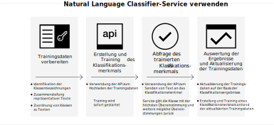

---

copyright:
  years: 2015, 2019
lastupdated: "2019-03-06"

keywords: Natural Language Classifier service,Use cases,supported languages,language support

subcollection: natural-language-classifier

---

{:new_window: target="_blank"}
{:shortdesc: .shortdesc}

# Informationen
{: #about}

{{site.data.keyword.nlclassifierfull}} verwendet Algorithmen für maschinelles Lernen, um für kurze Texteingaben die vordefinierten Klassen zurückzugeben, die die höchste Übereinstimmung aufweisen.
{:shortdesc}

{{site.data.keyword.nlclassifiershort}} kann Ihre Anwendung dabei unterstützen, die Sprache kurzer Texte zu verstehen und Vorhersagen zu ihrer Verarbeitung zu erstellen. Ein Klassifikationsmerkmal ('Classifier') lernt anhand Ihrer Beispieldaten und kann anschließend Informationen zu Texten zurückgeben, anhand derer es nicht trainiert wurde.

## Verwendung des Service
{: #overview-how-to-use}

Die folgende Abbildung zeigt den Prozess für das Erstellen und Verwenden des Klassifikationsmerkmals an:

## Anwendungsfälle
{: #use-cases}

Sie können {{site.data.keyword.nlclassifiershort}} in vielen verschiedenen Anwendungen und Branchen verwenden. Hier einige Beispiele: 

- **Banken und Finanzwirtschaft**: Klassifizierung von Investitionen, Risiken und Transaktionen. 
- **Hochschulen und Regierung**: Einsortierung von Texten oder Dokumenten in Kategorien. Nützlich für den akademischen und juristischen Bereich sowie für gemeinnützige Organisationen und andere Organisationen, die Klassifizierungsfunktionen benötigen. 
- **E-Commerce und Einzelhandel**: Unterstützung der Benutzer bei der Auswahl von Produkten durch Eingrenzung der Auswahlmöglichkeiten nach Thema. Kennzeichnung von Produkten mit Tags oder Identifikation von betrügerischen Artikeln. 
- **Services**: Kategorisierung von Serviceanfragen, Nachrichten und Antworten, um die Behebung von Problemen und die Bereitstellung von Lösungen zu beschleunigen. 
- **Social Media**: Einordnung von Tweets, E-Mails, Beiträgen und geteilten Elementen in Kategorien oder Themen. 
- **Lösungen für das Personalwesen**: Analyse von Lebensläufen und Bewerbungen, um versteckte Informationen zu finden. 

Mit {{site.data.keyword.nlclassifiershort}} können Sie die Daten nach Belieben analysieren und kategorisieren. 

## Unterstützte Sprachen
{: #supported-languages}

{{site.data.keyword.nlclassifiershort}} unterstützt Englisch, Arabisch, Französisch, Deutsch, Italienisch, Japanisch, Koreanisch, Portugiesisch (Brasilien) und Spanisch. 

## Nächste Schritte
{: #next-steps}

- [Los geht's](/docs/services/natural-language-classifier?topic=natural-language-classifier-natural-language-classifier#natural-language-classifier) mit dem Service.
- Probieren Sie die [Demo ](https://natural-language-classifier-demo.ng.bluemix.net/){:new_window} aus.
- Erkunden Sie die [Beispielapps](/docs/services/natural-language-classifier?topic=natural-language-classifier-sample-applications#sample-applications) mit Verwendungsbeispielen. 
