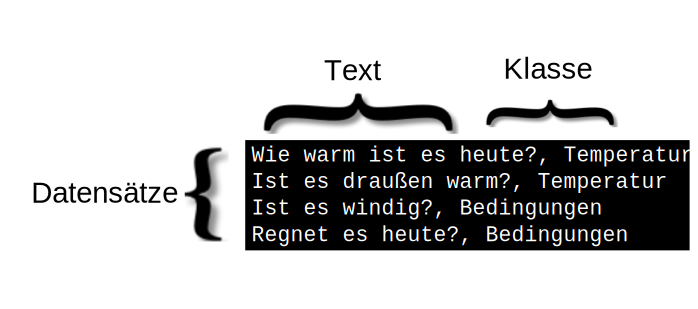

---

copyright:
  years: 2015, 2019
lastupdated: "2019-03-06"

keywords: data preparation,training data,size limitations,csv,file format,classes,texts

subcollection: natural-language-classifier

---

{:new_window: target="_blank"}
{:shortdesc: .shortdesc}

# Datenaufbereitung
{: #using-your-data}

Nach dem Erstellen, Trainieren und Abfragen einer {{site.data.keyword.nlclassifierfull}}-Instanz mit den Daten im Beispiel unter [Einführung](/docs/services/natural-language-classifier?topic=natural-language-classifier-natural-language-classifier#natural-language-classifier) möchten Sie ein Klassifikationsmerkmal erstellen, das mit Ihren eigenen Daten arbeitet. Diese Trainingsdaten werden von Ihnen zusammengestellt und bereitgestellt.
{:shortdesc}

## Struktur der Trainingsdaten
{: #training-structure}

Sie können die Daten zum Trainieren der {{site.data.keyword.nlclassifiershort}}-Instanz im CSV-Format bereitstellen.

Im CSV-Format stellt eine Zeile der Datei einen Beispieldatensatz dar. Jeder Datensatz hat mindestens zwei Spalten. Die erste Spalte ist der repräsentative Text, der klassifiziert werden soll. Die zusätzlichen Spalten sind Klassen, die für diesen Text gültig sind. Die folgende Abbildung zeigt eine CSV-Datei mit vier Datensätzen. In jedem Datensatz in diesem Beispiel sind getrennt durch ein Komma die Texteingabe und eine Klasse enthalten:

Es handelt sich hier um ein kleines Beispiel. Richtige Trainingsdaten umfassen weit mehr Datensätze.

Laden Sie die Datei <a target="_blank" href="https://watson-developer-cloud.github.io/doc-tutorial-downloads/natural-language-classifier/weather_data_train.csv" download="weather_data_train.csv">weather_data_train.csv</a> herunter, um eine Beispieldatei für Trainingsdaten anzuzeigen.

### Zusätzliche Metadaten
{: #additional-metadata}

Zusätzlich zu den Texten und Klassen umfasst die Anforderung für die Erstellung eines Klassifikationsmerkmals weitere Informationen. Die Metadaten geben die Sprache der Daten an und Sie können auch einen Namen einschließen, um das Klassifikationsmerkmal leichter zu identifizieren.

### Dateiformat für CSV-Trainingsdaten
{: #csv-file-format}

Stellen Sie sicher, dass Ihre CSV-Trainingsdaten folgende Formatvoraussetzungen erfüllen:

- Die Daten müssen die UTF-8-Codierung aufweisen.
- Textwerte und die einzelnen Klassenwerte müssen durch ein Komma als Trennzeichen getrennt werden. Jeder Datensatz (Zeile) endet mit einem Zeilenendezeichen, bei dem es sich um ein Sonderzeichen oder eine Zeichenfolge handelt, das bzw. die das Ende einer Zeile angibt.
- Jeder Datensatz muss einen Textwert und mindestens einen Klassenwert aufweisen.
- Klassenwerte dürfen keine Tabulatoren oder Zeilenendezeichen enthalten.
- Ohne eine besondere Handhabung dürfen Textwerte keine Tabulatoren oder Zeilenumbrüche enthalten. Damit Tabulatoren oder Zeilenumbrüche erhalten bleiben, versehen Sie einen Tabulator mit `\t` und einen Zeilenumbruch mit `\r`, `\n` oder `\r\n`.

Beispiel: `Example text\twith a tab` ist gültig, <code>Example text&nbsp;&nbsp;&nbsp;&nbsp;with a tab</code> jedoch nicht.
- Schließen Sie Text- oder Klassenwerte in den Trainingsdaten stets in Anführungszeichen ein, wenn folgende Zeichen enthalten sind:
    - Kommas: `"Example text, with comma"`.
    - Anführungszeichen. Darüber hinaus müssen Anführungszeichen nochmals mit Anführungszeichen als Escapezeichen versehen werden: `"Example text with ""quotation"""`.

## Größenbegrenzungen
{: #training-limits}

Für die Trainingsdaten gelten sowohl Mindestwerte als auch Maximalwerte:

- Die Trainingsdaten müssen mindestens fünf Datensätze (Zeilen), höchstens 20.000 Datensätze und höchstens 3.000 Klassen aufweisen. 
- Die maximale Gesamtlänge eines Textwerts beträgt 1024 Zeichen.
