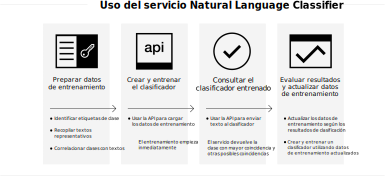

---

copyright:
  years: 2015, 2019
lastupdated: "2019-03-06"

keywords: Natural Language Classifier service,Use cases,supported languages,language support

subcollection: natural-language-classifier

---

{:new_window: target="_blank"}
{:shortdesc: .shortdesc}

# Acerca de
{: #about}

{{site.data.keyword.nlclassifierfull}} utiliza algoritmos de aprendizaje de máquina para devolver las principales clases predefinidas coincidentes para entradas de texto cortas.
{:shortdesc}

{{site.data.keyword.nlclassifiershort}} puede ayudar a su aplicación a entender el lenguaje de textos cortos y a hacer predicciones sobre cómo manejarlos. Un clasificador aprende de sus datos de ejemplo y puede devolver información sobre textos sobre los que no está entrenado.

## Cómo utilizar el servicio
{: #overview-how-to-use}

En la siguiente imagen se muestra el proceso de creación y utilización del clasificador:

## Casos prácticos
{: #use-cases}

Puede utilizar {{site.data.keyword.nlclassifiershort}} en muchas aplicaciones y sectores diferentes. Estos son algunos ejemplos:

- **Banca y finanzas**: clasifica inversiones, riesgos y transacciones.
- **Educación superior y gobierno**: ordena texto o documentos en categorías. Es útil para entornos académicos, legales, organizaciones sin ánimo de lucro y otras organizaciones que requieren clasificación.
- **Comercio electrónico y venta al por menor**: ayuda a los usuarios a elegir productos mediante la reducción de las opciones por tema. Permite etiquetar productos o identificar artículos fraudulentos.
- **Servicios**: clasifica consultas de servicio, mensajes y respuestas para ayudar a resolver problemas y a desplegar soluciones más rápidamente.
- **Redes sociales**: organizar tweets, correo electrónico, publicaciones y comparticiones en categorías o temas.
- **Descubrimiento de talentos**: analiza currículums y aplicaciones para obtener información detallada.

Con {{site.data.keyword.nlclassifiershort}}, puede analizar y clasificar sus datos.

## Idiomas admitidos
{: #supported-languages}

{{site.data.keyword.nlclassifiershort}} admite inglés, árabe, francés, alemán, italiano, japonés, coreano, portugués (de Brasil) y español.

## Siguientes pasos
{: #next-steps}

- [Cómo empezar](/docs/services/natural-language-classifier?topic=natural-language-classifier-natural-language-classifier#natural-language-classifier) a trabajar con el servicio.
- Pruebe la [demostración ](https://natural-language-classifier-demo.ng.bluemix.net/){:new_window}.
- Explore las [apps de ejemplo](/docs/services/natural-language-classifier?topic=natural-language-classifier-sample-applications#sample-applications) para ver ejemplos de uso.
