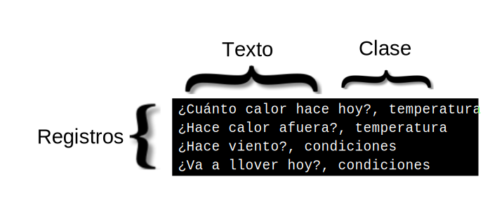

---

copyright:
  years: 2015, 2019
lastupdated: "2019-03-06"

keywords: data preparation,training data,size limitations,csv,file format,classes,texts

subcollection: natural-language-classifier

---

{:new_window: target="_blank"}
{:shortdesc: .shortdesc}

# Preparación de los datos
{: #using-your-data}

Después de crear, entrenar y consultar un {{site.data.keyword.nlclassifierfull}} con los datos del ejemplo de [Cómo empezar](/docs/services/natural-language-classifier?topic=natural-language-classifier-natural-language-classifier#natural-language-classifier), deseará crear un clasificador que trabaje con sus propios datos. Debe ensamblar y proporcionar estos datos de entrenamiento.
{:shortdesc}

## Estructura de los datos de entrenamiento
{: #training-structure}

Puede proporcionar los datos para entrenar el servicio {{site.data.keyword.nlclassifiershort}} en formato de valores separador por comas (CSV).

En el formato CSV, una fila del archivo representa un registro del ejemplo. Cada registro tiene dos o más columnas. La primera columna es el texto representativo que hay que clasificar. Las columnas adicionales son clases que se aplican a dicho texto. En la imagen siguiente se muestra un archivo CSV que tiene cuatro registros. Cada registro del ejemplo incluye la entrada de texto y una clase, separados por una coma:

Este es un pequeño ejemplo. Los datos de entrenamiento correctos incluyen muchos más registros.

Descargue el archivo <a target="_blank" href="https://watson-developer-cloud.github.io/doc-tutorial-downloads/natural-language-classifier/weather_data_train.csv" download="weather_data_train.csv">weather_data_train.csv</a> para ver un archivo de datos de entrenamiento de ejemplo.

### Metadatos adicionales
{: #additional-metadata}

Además del texto y las clases, la solicitud para crear un clasificador incluye información adicional. Los metadatos identifican el idioma de los datos; también puede incluir un nombre para ayudarle a identificar el clasificador.

### Formato del archivo de datos de entrenamiento CSV
{: #csv-file-format}

Asegúrese de que los datos de entrenamiento CSV cumplen los siguientes requisitos de formato:

- Los datos deben tener la codificación UTF-8.
- Separe los valores de texto y cada valor de clase por una coma como delimitador. Cada registro (fila) debe terminar con un carácter de fin de línea, que es un carácter especial o secuencia de caracteres que indica el fin de línea.
- Cada registro debe tener un valor de texto y al menos un valor de clase.
- Los valores de clase no pueden incluir tabuladores ni caracteres de fin de línea.
- Los valores de texto no pueden contener tabuladores ni nuevas líneas sin manejo especial. Para conservar los tabuladores o nuevas líneas, utilice un carácter de espacio del tabulador, `\t`, y uno de líneas nuevas, `\r`, `\n` o `\r\n`.

    Por ejemplo, `Texto de ejemplo\tcon un tabulador` es válido, pero <code>Texto de ejemplo&nbsp;&nbsp;&nbsp;&nbsp;con un tabulador</code> no es válido.
- Especifique siempre los valores de texto o de clase entre comillas dobles en los datos de entrenamiento cuando incluyan los siguientes caracteres:
    - Comas: `"Texto de ejemplo, con coma"`.
    - Comillas dobles. Además, si hay comillas dobles hay que especificar el carácter de espacio con comillas dobles: `"Texto de ejemplo con ""comillas"""`.

## Limitaciones de tamaño
{: #training-limits}

Hay límites mínimo y máximo para los datos de entrenamiento:

- Los datos de entrenamiento deben tener al menos cinco registros (filas), no más de 20.000 registros y no más de 3.000 clases.
- La longitud máxima total de un valor de texto es 1024 caracteres.
