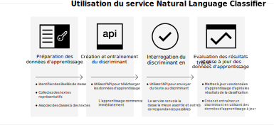

---

copyright:
  years: 2015, 2019
lastupdated: "2019-03-06"

keywords: Natural Language Classifier service,Use cases,supported languages,language support

subcollection: natural-language-classifier

---

{:new_window: target="_blank"}
{:shortdesc: .shortdesc}

# A propos du service
{: #about}

{{site.data.keyword.nlclassifierfull}} utilise des algorithmes d'apprentissage automatique afin de renvoyer les classes prédéfinies qui correspondent le mieux pour des entrées de texte court.
{:shortdesc}

{{site.data.keyword.nlclassifiershort}} peut aider votre application à comprendre la langue de textes courts et à prévoir comment les traiter. Un discriminant effectue son apprentissage à partir de vos exemples de données, puis peut
renvoyer des informations pour les textes pour lesquels il n'est pas entraîné.

## Utilisation du service
{: #overview-how-to-use}

L'image suivante représente le processus de création et d'utilisation du
discriminant :

## Cas d'utilisation
{: #use-cases}

Vous pouvez utiliser {{site.data.keyword.nlclassifiershort}} dans de nombreuses applications et industries différentes. En voici quelques exemples :

- **Banque et finances** : Classifier des investissements, des risques et des transactions.
- **Enseignement supérieur et gouvernement** : Classer du texte et des documents en catégories. Utile pour les universités, le droit, les organismes à but non lucratif et autres organisations qui exigent une classification.
- **Commerce électronique et vente au détail** : Aider vos utilisateurs à sélectionner des produits en restreignant les choix par thème. Marquer des produits ou identifier des articles frauduleux.
- **Services** : Catégoriser des demandes de service, des messages et des réponses pour aider à traiter les problèmes et à développer rapidement des solutions.
- **Réseaux sociaux** : Organiser des tweets, des courriers électroniques, des articles et des partages en catégories ou thèmes.
- **Solutions de talent** : Analyser des curriculum vitae et des applications pour en tirer une meilleure connaissance.

Avec {{site.data.keyword.nlclassifiershort}}, les données sont à vous pour les analyser et les catégoriser.

## Langues prises en charge
{: #supported-languages}

{{site.data.keyword.nlclassifiershort}} prend en charge l'anglais, l'arabe, le français, l'allemand, l'italien, le japonais, le coréen, le portugais (Brésil) et l'espagnol.

## Etapes suivantes
{: #next-steps}

- [Initiez-vous](/docs/services/natural-language-classifier?topic=natural-language-classifier-natural-language-classifier#natural-language-classifier) au service.
- Suivez la [démonstration ](https://natural-language-classifier-demo.ng.bluemix.net/){:new_window}.
- Explorez les [exemples d'application](/docs/services/natural-language-classifier?topic=natural-language-classifier-sample-applications#sample-applications) pour découvrir des exemples d'utilisation.
