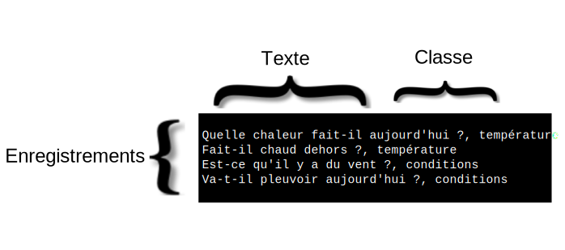

---

copyright:
  years: 2015, 2019
lastupdated: "2019-03-06"

keywords: data preparation,training data,size limitations,csv,file format,classes,texts

subcollection: natural-language-classifier

---

{:new_window: target="_blank"}
{:shortdesc: .shortdesc}

# Préparation des données
{: #using-your-data}

Après avoir créé, entraîné et interrogé un discriminant du service {{site.data.keyword.nlclassifierfull}} avec les données figurant dans l'exemple [Initiation](/docs/services/natural-language-classifier?topic=natural-language-classifier-natural-language-classifier#natural-language-classifier), créez un discriminant qui fonctionne avec vos propres données. Vous allez assembler et fournir ces données d'apprentissage.
{:shortdesc}

## Structure des données d'apprentissage
{: #training-structure}

Vous pouvez fournir les données permettant d'entraîner
{{site.data.keyword.nlclassifiershort}} au format CSV.

Au format CSV, chaque ligne dans le fichier représente un exemple d'enregistrement. Chaque enregistrement comporte deux colonnes ou plus. La première colonne est le texte représentatif à classifier. Les autres colonnes comportent les classes à appliquer à ce texte. L'image ci-dessous représente un fichier CSV contenant quatre enregistrements. Chaque enregistrement dans l'exemple inclut le texte entré et une classe, séparés par une virgule :

Cet exemple est petit. De véritables données d'apprentissage incluent beaucoup plus d'enregistrements.

Téléchargez le fichier <a target="_blank" href="https://watson-developer-cloud.github.io/doc-tutorial-downloads/natural-language-classifier/weather_data_train.csv" download="weather_data_train.csv">weather_data_train.csv</a> pour afficher un exemple de fichier de données d'apprentissage.

### Métadonnées supplémentaires
{: #additional-metadata}

En plus du texte et des classes, la demande de création d'un discriminant inclut des informations supplémentaires. Les métadonnées identifient la langue des données, et vous pouvez également inclure un nom permettant d'identifier le discriminant.

### Format de fichier de données d'apprentissage CSV
{: #csv-file-format}

Veillez à ce que les données d'apprentissage CSV respectent les exigences de format suivantes :

- Les données doivent être codées en UTF-8.
- Séparez les valeurs textuelles et chaque valeur de classe par une virgule. Chaque enregistrement (ligne) doit se terminer par un caractère de fin de ligne, c'est-à-dire un caractère spécial ou une séquence de caractères indiquant la fin de la ligne.
- Chaque enregistrement doit comporter une valeur textuelle et au moins une valeur de classe.
- Les valeurs de classe ne peuvent pas comporter de tabulation ni de caractère de fin de ligne.
- Les valeurs textuelles ne peuvent pas comporter de tabulation ni de nouvelle ligne sans traitement spécial. Pour conserver les tabulations ou les nouvelles lignes, mettez les tabulations en échappement avec `\t` et les nouvelles lignes avec `\r`, `\n` ou `\r\n`.

    Par exemple, `Texte exemple\tavec tabulation` est valide, alors que <code>Texte exemple&nbsp;&nbsp;&nbsp;&nbsp;avec tabulation</code> ne l'est pas.
- Placez toujours les valeurs textuelles et de classe entre guillemets dans les données d'apprentissage si elles comportent les caractères suivants :
    - Des virgules : `"Texte exemple, avec virgule"`.
    - Des guillemets. De plus, les guillemets doivent être mis en échappement avec des guillemets : `"Texte exemple avec ""guillemets"""`.

## Limites de taille
{: #training-limits}

Il existe des limites minimale et maximale pour les données d'apprentissage :

- Les données d'apprentissage doivent comporter entre 5 et 20 000 enregistrements (lignes) et 3 000 classes au maximum.
- La longueur totale maximale d'une valeur textuelle est de 1024 caractères.
