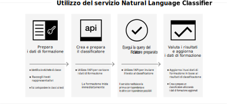

---

copyright:
  years: 2015, 2019
lastupdated: "2019-03-06"

keywords: Natural Language Classifier service,Use cases,supported languages,language support

subcollection: natural-language-classifier

---

{:new_window: target="_blank"}
{:shortdesc: .shortdesc}

# Informazioni 
{: #about}

{{site.data.keyword.nlclassifierfull}} utilizza gli algoritmi di apprendimento automatico (machine learning) per restituire le classi più corrispondenti per le immissioni di brevi testi.
{:shortdesc}

{{site.data.keyword.nlclassifiershort}} può aiutare la tua applicazione a comprendere la lingua di brevi testi e fare delle previsioni su come gestirli. Un classificatore fornisce informazioni sui dati di esempio e può restituire le informazioni per i testi su cui non è preparato.

## Come utilizzi il servizio
{: #overview-how-to-use}

La seguente immagine illustra il processo di creazione e utilizzo del classificatore:

## Casi di utilizzo
{: #use-cases}

Puoi utilizzare {{site.data.keyword.nlclassifiershort}} in molte applicazioni o settori differenti. Di seguito sono riportati degli esempi:

- **Servizi bancari o finanziari**: classifica gli investimenti, i rischi e le transazioni.
- **Istituti di istruzione superiore e governativi**: ordina il testo o i documenti in categorie. Utile per le organizzazioni accademiche, legali o no profit e altre organizzazione che richiedono la classificazione.
- **Aziende di commercio elettronico e al dettaglio**: consente ai tuoi utenti di scegliere i prodotti restringendo le scelte per temi. Contrassegna i prodotti o identifica gli articoli fraudolenti.
- **Servizi**: categorizza le query, i messaggi e le risposte del servizio per risolvere i problemi e distribuire le soluzioni più velocemente.
- **Social media**: organizza tweet, email, post e condivisioni in categorie o temi.
- **Soluzioni di offerta lavoro**: analizza curricula e moduli di domanda per ricavare informazioni più approfondite.

Con {{site.data.keyword.nlclassifiershort}}, i dati sono tuoi per l'analisi e la categorizzazione.

## Lingue supportate
{: #supported-languages}

{{site.data.keyword.nlclassifiershort}} supporta inglese, arabo, francese, tedesco, italiano, giapponese, coreano, portoghese (brasiliano) e spagnolo.

## Passi successivi
{: #next-steps}

- [Inizia ad utilizzare](/docs/services/natural-language-classifier?topic=natural-language-classifier-natural-language-classifier#natural-language-classifier) il servizio.
- Prova la nostra [demo ](https://natural-language-classifier-demo.ng.bluemix.net/){:new_window}.
- Esplora le [Applicazioni di esempio](/docs/services/natural-language-classifier?topic=natural-language-classifier-sample-applications#sample-applications) per degli esempi di utilizzo.
