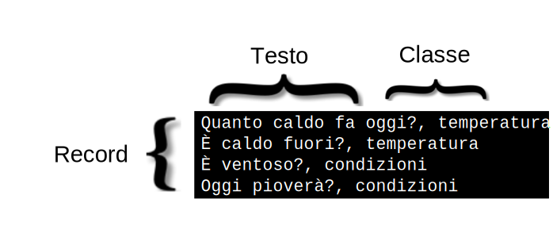

---

copyright:
  years: 2015, 2019
lastupdated: "2019-03-06"

keywords: data preparation,training data,size limitations,csv,file format,classes,texts

subcollection: natural-language-classifier

---

{:new_window: target="_blank"}
{:shortdesc: .shortdesc}

# Preparazione dei dati
{: #using-your-data}

Dopo aver creato, preparato ed eseguito la query di {{site.data.keyword.nlclassifierfull}} con i dati nell'esempio in [Introduzione](/docs/services/natural-language-classifier?topic=natural-language-classifier-natural-language-classifier#natural-language-classifier), desidererai creare un classificatore che utilizza i tuoi propri dati. Assembla e fornisci questi dati di formazione.
{:shortdesc}

## Struttura dei dati di formazione
{: #training-structure}

Puoi fornire i dati per preparare {{site.data.keyword.nlclassifiershort}} nel formato separato da virgole (CSV).

Nel formato CSV, una riga nel file rappresenta un record di esempio. Ogni record ha due o più colonne. La prima colonna è il testo rappresentativo da classificare. Le colonne aggiuntive sono classi che si applicano a tale testo. La seguente immagine mostra un file CSV con quattro record. Ogni record in questo esempio include l'input di testo e una classe, che sono separati da una virgola:

Questo esempio è un piccolo esempio. I dati di formazione appropriati includono molti più record.

Scarica il file <a target="_blank" href="https://watson-developer-cloud.github.io/doc-tutorial-downloads/natural-language-classifier/weather_data_train.csv" download="weather_data_train.csv">weather_data_train.csv</a> per visualizzare un file dei dati di formazione di esempio.

### Metadati aggiuntivi
{: #additional-metadata}

In aggiunta al testo e alle classi, la richiesta, per creare un classificatore, include ulteriori informazioni. I metadati identificano i dati e puoi anche includere un nome per aiutarti nell'identificare il classificatore.

### Formato del file dei dati di formazione
{: #csv-file-format}

Assicurati che i tuoi dati di formazione CSV rispettino i seguenti requisiti del formato:

- I dati devono essere codificati in UTF-8.
- Separa i valori del testo e ogni valore della classe da un delimitatore virgola. Ogni record (riga) termina con un carattere di fine riga, che è un carattere speciale o una sequenza di caratteri che indica la fine della riga.
- Ogni record deve avere un valore testo e almeno un valore classe.
- I valori della classe non possono includere tasti tab o caratteri di fine riga.
- I valori del testo non possono contenere tasti tab o nuove righe senza una gestione speciale. Per conservare i tasti tab o le nuove righe, eludi il tasto tab con `\t` e le nuove righe con `\r`, `\n` o `\r\n`.

    Ad esempio, `Example text\twith a tab` è valido ma <code>Example text&nbsp;&nbsp;&nbsp;&nbsp;with a tab</code> non lo è.
- Racchiudi sempre i valori testo o classe tra virgolette nei dati di formazione quando includono i seguenti caratteri:
    - Virgole: `"Example text, with comma"`.
    - Virgolette. In aggiunta, le virgolette devono essere sostituite con doppie virgolette: `"Example text with ""quotation"""`.

## Limitazioni della dimensione.
{: #training-limits}

Esiste sia il limite minimo che massimo dei dati di formazione:

- I dati di formazione devono avere almeno cinque record (righe), non più di 20.000 record e non più di 3.000 classi. 
- La lunghezza totale massima di un valore di testo è di 1024 caratteri.
