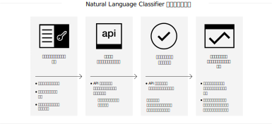

---

copyright:
  years: 2015, 2019
lastupdated: "2019-03-06"

keywords: Natural Language Classifier service,Use cases,supported languages,language support

subcollection: natural-language-classifier

---

{:new_window: target="_blank"}
{:shortdesc: .shortdesc}

# 製品情報
{: #about}

{{site.data.keyword.nlclassifierfull}} は機械学習アルゴリズムを使用して、ショート・テキスト入力に対して最も一致度の高い定義済みクラスを返します。
{:shortdesc}

{{site.data.keyword.nlclassifiershort}} は、アプリケーションがショート・テキストの言語を理解し、それらのテキストの処理方法を予測するのに役立ちます。 分類子は、サンプル・データから学習した後、トレーニングされていないテキストに関する情報を返すことができるようになります。

## このサービスの使用方法
{: #overview-how-to-use}

以下のイメージは、分類子を作成して使用するプロセスを示しています。

## ユース・ケース
{: #use-cases}

{{site.data.keyword.nlclassifiershort}} は、多種多様なアプリケーションや業種で使用できます。以下にいくつか例を示します。

- **銀行や金融**: 投資、リスク、取引を分類できます。
- **高等教育機関や政府機関**: テキストや文書をカテゴリー別に分類できます。分類作業を必要とする教育機関、法律機関、非営利団体などの組織で使用できます。
- **E-コマースと小売**: テーマ別に選択肢を絞って商品を選びやすくします。商品にタグを付けたり、不正なアイテムを検出したりできます。
- **サービス**: サービスに関する問い合わせ、メッセージ、反応をカテゴリー化して、問題対応に役立てたり、ソリューションの迅速なデプロイを促進したりできます。
- **ソーシャル・メディア**: ツイート、E メール、投稿、共有をカテゴリー別またはテーマ別に編成できます。
- **人材採用ソリューション**: 履歴書や応募申込書を分析して、深い意味を引き出せます。

{{site.data.keyword.nlclassifiershort}} を使用すれば、データを自分で解析してカテゴリー化できます。

## サポートされる言語
{: #supported-languages}

{{site.data.keyword.nlclassifiershort}} では、英語、アラビア語、フランス語、ドイツ語、イタリア語、日本語、韓国語、ポルトガル語 (ブラジル)、スペイン語がサポートされています。

## 次のステップ
{: #next-steps}

- サービスを[開始します](/docs/services/natural-language-classifier?topic=natural-language-classifier-natural-language-classifier#natural-language-classifier)。
- [デモ ](https://natural-language-classifier-demo.ng.bluemix.net/){:new_window} を試してみます。
- [サンプル・アプリ](/docs/services/natural-language-classifier?topic=natural-language-classifier-sample-applications#sample-applications)で使用例を探索してください。
