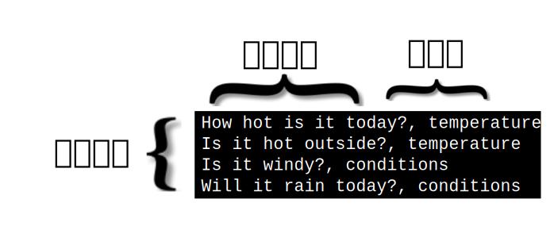

---

copyright:
  years: 2015, 2019
lastupdated: "2019-03-06"

keywords: data preparation,training data,size limitations,csv,file format,classes,texts

subcollection: natural-language-classifier

---

{:new_window: target="_blank"}
{:shortdesc: .shortdesc}

# データの準備
{: #using-your-data}

[開始](/docs/services/natural-language-classifier?topic=natural-language-classifier-natural-language-classifier#natural-language-classifier)の例のデータを使用して {{site.data.keyword.nlclassifierfull}} の作成、トレーニング、および照会を行ったら、独自データで動作する分類子を作成することができます。 このトレーニング・データを作成して指定します。
{:shortdesc}

## トレーニング・データの構造
{: #training-structure}

{{site.data.keyword.nlclassifiershort}} のトレーニングのためのデータをコンマ区切り値 (CSV) フォーマットで提供できます。

CSV フォーマットでは、ファイル内の行は 1 つのサンプル・レコードを表します。 各レコードには複数の列があります。 最初の列は、分類する典型的なテキストです。 追加の列は、そのテキストに適用されるクラスです。 以下のイメージは、4 つのレコードがある CSV ファイルを示しています。 このサンプル内の各レコードには、テキスト入力と 1 つのクラスが含まれ、コンマで区切られています。

この例は小規模なサンプルです。 通常のトレーニング・データには、これより多くのレコードが含まれています。

<a target="_blank" href="https://watson-developer-cloud.github.io/doc-tutorial-downloads/natural-language-classifier/weather_data_train.csv" download="weather_data_train.csv">weather_data_train.csv</a> ファイルをダウンロードして、サンプルのトレーニング・データ・ファイルを確認します。

### 追加のメタデータ
{: #additional-metadata}

分類子を作成する要求には、テキストとクラスに加えて、追加情報が含まれています。 メタデータは、データの言語を指定します。分類子を識別するために役立つ名前を含めることもできます。

### CSV トレーニング・データ・ファイル・フォーマット
{: #csv-file-format}

CSV トレーニング・データが以下のフォーマット要件に準拠していることを確認してください。

- データは UTF-8 エンコードでなければなりません。
- テキスト値と各クラス値をコンマ区切り文字で区切ってください。 各レコード (行) は行末文字で終了します。行末文字は、行の終わりを示す 1 つの特殊文字または文字のシーケンスです。
- 各レコードには、1 つのテキスト値と少なくとも 1 つのクラス値が必要です。
- クラス値にタブや行末文字を含めることはできません。
- 特別な処理を行わない限り、テキスト値にタブや改行を含めることはできません。 タブまたは改行を保持するには、`\t` を指定してタブをエスケープし、`\r`、`\n`、または `\r\n` を指定して改行をエスケープします。

    例えば、`Example text\twith a tab` は有効ですが、<code>Example text    with a tab</code> は無効です。
- トレーニング・データに以下の文字が含まれている場合は、必ずテキスト値またはクラス値を二重引用符で囲んでください。
    - コンマ: `"Example text, with comma"`。
    - 二重引用符。 また、引用符は二重引用符でエスケープする必要があります。`"Example text with ""quotation"""`。

## サイズ制限
{: #training-limits}

トレーニング・データには、最小制限と最大制限の両方があります。

- トレーニング・データのレコード (行) 数は 5 個から 20,000 個まででなければなりません。クラスの最大数は 3,000 個です。
- テキスト値の最大合計長は 1024 文字です。
