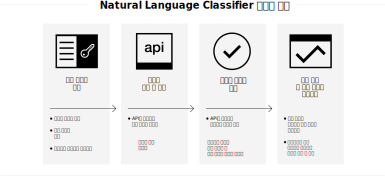

---

copyright:
  years: 2015, 2019
lastupdated: "2019-03-06"

keywords: Natural Language Classifier service,Use cases,supported languages,language support

subcollection: natural-language-classifier

---

{:new_window: target="_blank"}
{:shortdesc: .shortdesc}

# 제품 정보
{: #about}

{{site.data.keyword.nlclassifierfull}}는 기계 학습 알고리즘을 사용하여 단문 텍스트 입력과 가장 잘 일치하는 사전 정의된 클래스를 리턴합니다.
{:shortdesc}

{{site.data.keyword.nlclassifiershort}}는 애플리케이션이 단문 텍스트의 언어를 이해하고 해당 텍스트의 처리 방법을 예측할 수 있도록 도와줍니다. 분류자는 예제 데이터를 통해 훈련한 후에 아직 훈련되지 않은 텍스트에 대한 정보를 리턴할 수 있습니다.

## 서비스 사용법
{: #overview-how-to-use}

다음 이미지는 분류자를 작성하고 사용하는 프로세스를 보여줍니다.

## 유스 케이스
{: #use-cases}

여러 애플리케이션 및 산업에서 {{site.data.keyword.nlclassifiershort}}를 사용할 수 있습니다. 다음은 몇 가지 예입니다. 

- **뱅킹 및 금융**: 투자, 리스크 및 거래를 분류합니다. 
- **고등 교육 및 정부**: 텍스트 또는 문서를 카테고리로 정렬합니다. 학계, 법조계, 비영리 기관 및 분류가 필요한 기타 기관에 유용합니다. 
- **전자상거래 및 유통**: 사용자가 테마를 기준으로 선택사항을 좁혀 제품을 선택할 수 있도록 도움을 줍니다. 제품에 태그를 지정하거나 사기 항목을 식별합니다. 
- **서비스**: 문제점을 해결하고 솔루션을 더 빨리 배치하는 데 도움이 되도록 서비스 조회, 메시지 및 응답을 분류합니다. 
- **소셜 미디어**: 트윗, 이메일, 게시물 및 공유물을 카테고리 또는 테마로 구성합니다. 
- **재능 솔루션**: 더 깊은 의미를 유추하기 위해 이력서와 지원서를 분석합니다. 

{{site.data.keyword.nlclassifiershort}}를 사용할 경우 구문 분석하고 분류할 데이터가 본인의 데이터입니다. 

## 지원 언어
{: #supported-languages}

{{site.data.keyword.nlclassifiershort}}는 영어, 아랍어, 프랑스어, 독일어, 이탈리아어, 일본어, 한국어, 브라질 포르투갈어, 스페인어를 지원합니다. 

## 다음 단계
{: #next-steps}

- 서비스 [시작하기](/docs/services/natural-language-classifier?topic=natural-language-classifier-natural-language-classifier#natural-language-classifier)
- [데모 ](https://natural-language-classifier-demo.ng.bluemix.net/){:new_window} 사용해 보기
- 예제 사용은 [샘플 앱](/docs/services/natural-language-classifier?topic=natural-language-classifier-sample-applications#sample-applications)을 탐색하십시오. 
