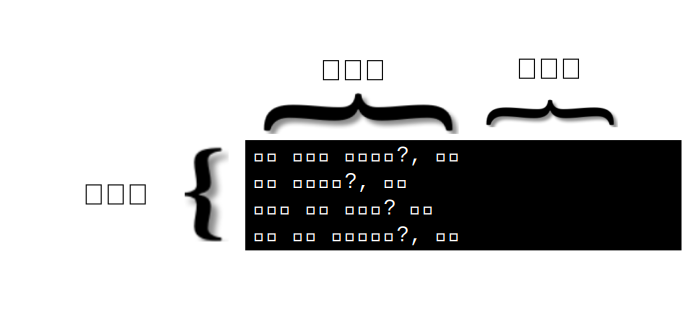

---

copyright:
  years: 2015, 2019
lastupdated: "2019-03-06"

keywords: data preparation,training data,size limitations,csv,file format,classes,texts

subcollection: natural-language-classifier

---

{:new_window: target="_blank"}
{:shortdesc: .shortdesc}

# 데이터 준비
{: #using-your-data}

[시작하기](/docs/services/natural-language-classifier?topic=natural-language-classifier-natural-language-classifier#natural-language-classifier) 예제의 데이터로 {{site.data.keyword.nlclassifierfull}}를 작성, 훈련하고 조회한 이후에 사용자는 자체 데이터에 대해 작업하는 분류자를 작성하고자 합니다. 사용자는 이 훈련 데이터를 어셈블하고 제공합니다.
{:shortdesc}

## 훈련 데이터의 구조
{: #training-structure}

CSV(Comma-Separated Value) 형식으로 {{site.data.keyword.nlclassifiershort}}를 훈련하기 위한 데이터를 제공할 수 있습니다.

CSV 형식에서 파일의 행은 예제 레코드를 표시합니다. 각각의 레코드에는 둘 이상의 열이 있습니다. 첫 번째 열은 분류할 대표 텍스트입니다. 추가 열은 해당 텍스트에 적용되는 클래스입니다. 다음 이미지는 4개의 레코드가 있는 CSV 파일을 표시합니다. 이 샘플의 각 레코드에는 텍스트 입력과 하나의 클래스가 포함되어 있으며, 이는 쉼표로 분리됩니다.

이 예제는 소형 샘플입니다. 적합한 훈련 데이터에는 다수의 추가 레코드가 포함됩니다.

샘플 훈련 데이터 파일을 보려면 <a target="_blank" href="https://watson-developer-cloud.github.io/doc-tutorial-downloads/natural-language-classifier/weather_data_train.csv" download="weather_data_train.csv">weather_data_train.csv</a> 파일을 다운로드하십시오.

### 추가 메타데이터
{: #additional-metadata}

텍스트 및 클래스와 함께, 분류자를 작성하기 위한 요청에는 추가 정보가 포함됩니다. 메타데이터는 데이터의 언어를 식별하며, 사용자는 분류자의 식별에 도움이 되도록 이름을 포함할 수도 있습니다.

### CSV 훈련 데이터 파일 형식
{: #csv-file-format}

CSV 훈련 데이터가 다음의 형식 요구사항을 준수하는지 확인하십시오.

- 데이터는 UTF-8 인코딩되어 있어야 합니다.
- 텍스트 값과 각각의 클래스 값을 쉼표 구분 기호로 분리합니다. 각각의 레코드(행)는 행 종료를 표시하는 특수 문자 또는 일련의 문자인 행 종료 문자로 끝납니다.
- 각 레코드에는 하나의 텍스트 값과 최소한 하나의 클래스 값이 있어야 합니다.
- 클래스 값에는 탭 또는 행 종료 문자가 포함될 수 없습니다.
- 텍스트 값에는 특수 처리 없는 탭이나 줄 바꾸기가 포함될 수 없습니다. 탭이나 줄 바꾸기를 그대로 유지하려면, `\t`로 탭을 이스케이프 처리하거나 `\r`, `\n` 또는 `\r\n`으로 줄 바꾸기를 이스케이프 처리하십시오.

    예를 들어 `Example text\twith a tab`은 유효하지만,<code>Example text&nbsp;&nbsp;&nbsp;&nbsp;with a tab</code>은 유효하지 않습니다.
- 다음 문자가 포함될 때는 훈련 데이터에서 항상 텍스트 또는 클래스 값을 큰따옴표로 묶으십시오.
    - 쉼표: `"Example text, with comma"`.
    - 큰따옴표. 또한 따옴표는 큰따옴표로 이스케이프 처리되어야 합니다. 예: `"Example text with ""quotation"""`.

## 크기 제한사항
{: #training-limits}

훈련 데이터에는 최소 및 최대 한계가 둘 다 있습니다.

- 훈련 데이터에는 최소 5개의 레코드(행), 최대 20,000개의 레코드, 최대 3,000개의 클래스가 있어야 합니다. 
- 텍스트 값의 최대 총 길이는 1024자입니다.
