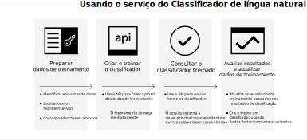

---

copyright:
  years: 2015, 2019
lastupdated: "2019-03-06"

keywords: Natural Language Classifier service,Use cases,supported languages,language support

subcollection: natural-language-classifier

---

{:new_window: target="_blank"}
{:shortdesc: .shortdesc}

# Sobre
{: #about}

O {{site.data.keyword.nlclassifierfull}} usa algoritmos de aprendizado de máquina para retornar as classes principais predefinidas correspondentes para entradas de texto curto.
{:shortdesc}

O {{site.data.keyword.nlclassifiershort}} pode ajudar o seu aplicativo a entender a linguagem de textos curtos e a fazer predições sobre como manipulá-los. Um classificador aprende com seus dados de exemplo e então pode retornar informações para os textos nos quais ele não está treinado.

## Como usar o serviço
{: #overview-how-to-use}

A imagem a seguir mostra o processo de criação e uso do classificador:

## Casos de uso
{: #use-cases}

É possível usar o {{site.data.keyword.nlclassifiershort}} em muitos aplicativos e segmentos de mercado diferentes. Aqui estão alguns exemplos:

- **Bancário e finanças**: classifique investimentos, riscos e transações.
- **Ensino Superior e governo**: classifique texto ou documentos em categorias. Útil para universidades, organizações jurídicas, organizações sem fins lucrativos e outras organizações que requerem classificação.
- **E-commerce e varejo**: ajude os seus usuários a escolherem produtos limitando as opções por tema. Identifique produtos ou identifique itens fraudulentos.
- **Serviços**: categorize consultas de serviço, mensagens e respostas para ajudar a abordar problemas e implementar soluções mais rapidamente.
- **Mídia social**: organize tweets, e-mail, posts e compartilhamentos em categorias ou temas.
- **Soluções de talento**: analise currículos e aplicativos para derivar um significado mais profundo.

Com o {{site.data.keyword.nlclassifiershort}}, os dados são seus para analisar e categorizar.

## Idiomas suportados
{: #supported-languages}

O {{site.data.keyword.nlclassifiershort}} suporta inglês, árabe, francês, alemão, italiano, japonês, coreano, português (brasileiro) e espanhol.

## Etapas Seguintes
{: #next-steps}

- [Introdução](/docs/services/natural-language-classifier?topic=natural-language-classifier-natural-language-classifier#natural-language-classifier) ao serviço.
- Experimente o [demo ](https://natural-language-classifier-demo.ng.bluemix.net/){:new_window}.
- Explore os [Aplicativos de amostra](/docs/services/natural-language-classifier?topic=natural-language-classifier-sample-applications#sample-applications) para usos de exemplo.
