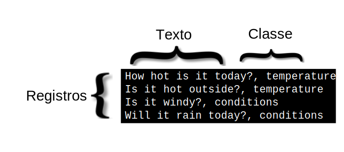

---

copyright:
  years: 2015, 2019
lastupdated: "2019-03-06"

keywords: data preparation,training data,size limitations,csv,file format,classes,texts

subcollection: natural-language-classifier

---

{:new_window: target="_blank"}
{:shortdesc: .shortdesc}

# Preparação de dados
{: #using-your-data}

Depois de criar, treinar e consultar um {{site.data.keyword.nlclassifierfull}} com os dados no exemplo [Introdução](/docs/services/natural-language-classifier?topic=natural-language-classifier-natural-language-classifier#natural-language-classifier), você desejará criar um classificador que trabalhe com seus próprios dados. Você monta e fornece esses dados de treinamento.
{:shortdesc}

## Estrutura de dados de treinamento
{: #training-structure}

É possível fornecer os dados para treinar o {{site.data.keyword.nlclassifiershort}} no formato de valor separado por vírgula (CSV).

No formato CSV, uma linha no arquivo representa um registro de exemplo. Cada registro possui duas ou mais colunas. A primeira coluna é o texto representativo a ser classificado. As colunas adicionais são classes que se aplicam a esse texto. A imagem a seguir mostra um arquivo CSV que tem quatro registros. Cada registro nessa amostra inclui a entrada de texto e uma classe, que são separadas por uma vírgula:

Este exemplo é uma pequena amostra. Dados de treinamento adequados incluem um número muito maior de registros.

Faça download do arquivo <a target="_blank" href="https://watson-developer-cloud.github.io/doc-tutorial-downloads/natural-language-classifier/weather_data_train.csv" download="weather_data_train.csv">weather_data_train.csv</a> para ver um arquivo de dados de treinamento de amostra.

### Metadados adicionais
{: #additional-metadata}

Além do texto e das classes, a solicitação para criar um classificador inclui informações adicionais. Os metadados identificam o idioma dos dados e também é possível incluir um nome para ajudá-lo a identificar o classificador.

### Formato de arquivo de dados de treinamento CSV
{: #csv-file-format}

Certifique-se de que seus dados de treinamento CSV sigam os requisitos de formato a seguir:

- Os dados devem ser codificados como UTF-8.
- Separe os valores de texto e cada valor de classe por um delimitador de vírgula. Cada registro (linha) é finalizado por um caractere de fim de linha, que é um caractere especial ou uma sequência de caracteres que indicam o final de uma linha.
- Cada registro deve ter um valor de texto e pelo menos um valor de classe.
- Os valores de classe não podem incluir guias ou caracteres de fim de linha.
- Os valores de texto não podem conter guias ou novas linhas sem manipulação especial. Para preservar guias ou novas linhas, escape uma guia com `\t` e escape novas linhas com `\r`, `\n` ou `\r\n`.

    Por exemplo, `Example text\twith a tab` é válido, mas o <code>Example text&nbsp;&nbsp;&nbsp;&nbsp;with a tab</code> não é válido.
- Sempre coloque valores de texto ou de classe entre aspas duplas nos dados de treinamento quando eles incluírem os caracteres a seguir:
    - Vírgulas: `"Example text, with comma"`.
    - Aspas duplas. Além disso, as aspas devem ser escapadas com aspas duplas: `"Example text with ""quotation"""`.

## Limitações de tamanho
{: #training-limits}

Há os limites mínimo e máximo para os dados de treinamento:

- Os dados de treinamento devem ter pelo menos cinco registros (linhas), não mais que 20.000 registros e não mais que 3.000 classes.
- O comprimento máximo total de um valor de texto é de 1.024 caracteres.
