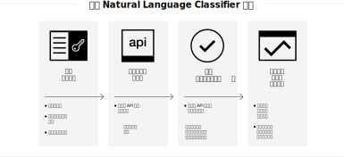

---

copyright:
  years: 2015, 2019
lastupdated: "2019-03-06"

keywords: Natural Language Classifier service,Use cases,supported languages,language support

subcollection: natural-language-classifier

---

{:new_window: target="_blank"}
{:shortdesc: .shortdesc}

# 关于
{: #about}

{{site.data.keyword.nlclassifierfull}} 使用机器学习算法，以针对简短文本输入返回匹配度最高的预定义类。
{:shortdesc}

{{site.data.keyword.nlclassifiershort}} 可以帮助应用程序了解简短文本的语言，并对如何处理这些文本进行预测。分类器通过示例数据进行学习，然后可以返回训练分类器时未包含的文本的信息。

## 如何使用服务
{: #overview-how-to-use}

下图显示了创建和使用分类器的过程：

## 用例
{: #use-cases}

您可以在许多不同的应用程序和行业中使用 {{site.data.keyword.nlclassifiershort}}。下面给出了一些示例：

- **银行与金融**：对投资、风险和交易进行分类。
- **高等教育与政府**：将文本或文档按类别排序。对学术组织、法律组织、非营利组织和其他需要分类的组织很有用。
- **电子商务与零售**：帮助您的用户通过按主题缩小选项来选择产品。标记产品或标识欺诈项。
- **服务**：对服务查询、消息和响应进行分类，以帮助更快地解决问题及部署解决方案。
- **社交媒体**：将推特、电子邮件、帖子和共享组织到类别或主题中。
- **人才解决方案**：分析简历和申请以加深了解。

使用 {{site.data.keyword.nlclassifiershort}}，您可以对数据进行解析和分类。

## 支持的语言
{: #supported-languages}

{{site.data.keyword.nlclassifiershort}} 支持英语、阿拉伯语、法语、德语、意大利语、日语、韩语、巴西葡萄牙语和西班牙语。

## 后续步骤
{: #next-steps}

- 服务[入门](/docs/services/natural-language-classifier?topic=natural-language-classifier-natural-language-classifier#natural-language-classifier)。
- 试用[演示 ](https://natural-language-classifier-demo.ng.bluemix.net/){:new_window}。
- 探索[样本应用程序](/docs/services/natural-language-classifier?topic=natural-language-classifier-sample-applications#sample-applications)以获取示例用法。
