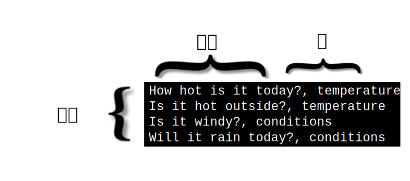

---

copyright:
  years: 2015, 2019
lastupdated: "2019-03-06"

keywords: data preparation,training data,size limitations,csv,file format,classes,texts

subcollection: natural-language-classifier

---

{:new_window: target="_blank"}
{:shortdesc: .shortdesc}

# 数据准备
{: #using-your-data}

使用[入门](/docs/services/natural-language-classifier?topic=natural-language-classifier-natural-language-classifier#natural-language-classifier)示例中的数据创建、训练和查询 {{site.data.keyword.nlclassifierfull}} 后，您会希望创建使用自己数据的分类器。您可组合并提供这些训练数据。
{:shortdesc}

## 训练数据的结构
{: #training-structure}

可以提供逗号分隔值 (CSV) 格式的数据来训练 {{site.data.keyword.nlclassifiershort}}。

CSV 格式的文件中，一行表示一个示例记录。每个记录有两列或更多列。第一列是要分类的代表性文本。其他列是应用于该文本的类。下图显示了具有四个记录的 CSV 文件。此样本中的每个记录都包含文本输入和一个类（以逗号分隔）：

此示例是很小的样本。正常训练数据包含的记录要多得多。

下载 <a target="_blank" href="https://watson-developer-cloud.github.io/doc-tutorial-downloads/natural-language-classifier/weather_data_train.csv" download="weather_data_train.csv">weather_data_train.csv</a> 文件可查看样本训练数据文件。

### 其他元数据
{: #additional-metadata}

除了文本和类，创建分类器的请求还包含其他信息。元数据用于识别数据的语言，此外还可包含名称来帮助标识分类器。

### CSV 训练数据文件格式
{: #csv-file-format}

确保 CSV 训练数据遵循以下格式需求：

- 数据必须采用 UTF-8 编码。
- 使用逗号定界符来分隔文本值和每个类值。每个记录（行）以行结束字符结尾；行结束字符是指示行结束的一个特殊字符或字符序列。
- 每个记录必须具有一个文本值以及至少一个类值。
- 类值不能包含制表符或行结束字符。
- 文本值不能包含未经特殊处理的制表符或换行符。要保留制表符或换行符，请使用 `\t` 对制表符转义，使用 `\r`、`\n` 或 `\r\n` 对换行符转义。

    例如，`Example text\twith a tab` 是有效的，但 <code>Example text&nbsp;&nbsp;&nbsp;&nbsp;with a tab</code> 是无效的。
- 在训练数据中，文本或类值包含以下字符时，务必用双引号将其括起：
    - 逗号：`"Example text, with comma"`。
    - 双引号。此外，引号必须使用双引号进行转义：`"Example text with ""quotation"""`。

## 大小限制
{: #training-limits}

训练数据有最小和最大限制：

- 训练数据必须至少有五个记录（行），但不超过 20,000 个记录，且不超过 3,000 个类。
- 文本值的最大总长度为 1024 个字符。
