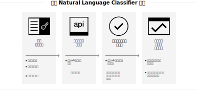

---

copyright:
  years: 2015, 2019
lastupdated: "2019-03-06"

keywords: Natural Language Classifier service,Use cases,supported languages,language support

subcollection: natural-language-classifier

---

{:new_window: target="_blank"}
{:shortdesc: .shortdesc}

# 關於
{: #about}

{{site.data.keyword.nlclassifierfull}} 使用機器學習演算法來傳回簡短文字輸入的前幾個相符預先定義類別。
{:shortdesc}

{{site.data.keyword.nlclassifiershort}} 可協助您的應用程式瞭解簡短文字的語言，並預測如何處理它們。分類器會從您的範例資料學習，接著便可以針對未對其進行訓練的文字傳回資訊。

## 如何使用服務
{: #overview-how-to-use}

下列影像顯示如何建立及使用分類器的程序：

## 使用案例
{: #use-cases}

您可以在許多不同的應用程式及產業中使用 {{site.data.keyword.nlclassifiershort}}。部分範例如下：

- **銀行及金融**：分類投資、風險及交易。
- **較高的教育及控管**：將文字或文件排序為種類。用於學術、法律、非營利組織，以及其他需要分類的組織。
- **電子商務及零售**：依佈景主題縮小選擇範圍，協助使用者選擇產品。標記產品，或識別欺詐項目。
- **服務**：分類服務查詢、訊息及回應，協助更快速地處理問題以及部署解決方案。
- **社交媒體**：將推文、電子郵件、貼文及共用組織為種類或佈景主題。
- **人資解決方案**：分析履歷及應用程式來衍生更深入的意義。

使用 {{site.data.keyword.nlclassifiershort}}，資料就是您要剖析及分類的專屬資料。

## 支援的語言
{: #supported-languages}

{{site.data.keyword.nlclassifiershort}} 支援英文、阿拉伯文、法文、德文、義大利文、日文、韓文、葡萄牙文（巴西）及西班牙文。

## 後續步驟
{: #next-steps}

- [開始使用](/docs/services/natural-language-classifier?topic=natural-language-classifier-natural-language-classifier#natural-language-classifier)服務。
- 試用[展示 ](https://natural-language-classifier-demo.ng.bluemix.net/){:new_window}。
- 探索[範例應用程式](/docs/services/natural-language-classifier?topic=natural-language-classifier-sample-applications#sample-applications)以瞭解範例使用。
