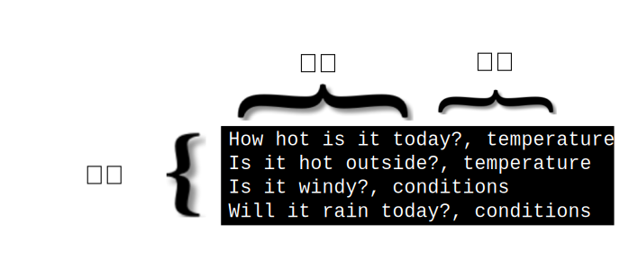

---

copyright:
  years: 2015, 2019
lastupdated: "2019-03-06"

keywords: data preparation,training data,size limitations,csv,file format,classes,texts

subcollection: natural-language-classifier

---

{:new_window: target="_blank"}
{:shortdesc: .shortdesc}

# 資料準備
{: #using-your-data}

使用[開始使用](/docs/services/natural-language-classifier?topic=natural-language-classifier-natural-language-classifier#natural-language-classifier)範例中的資料來建立、訓練及查詢 {{site.data.keyword.nlclassifierfull}} 之後，將會想要建立可使用您專屬資料的分類器。您可以組合及提供這個訓練資料。
{:shortdesc}

## 訓練資料結構
{: #training-structure}

您可以提供逗點區隔值 (CSV) 格式的資料來訓練 {{site.data.keyword.nlclassifiershort}}。

在 CSV 格式中，檔案中的一列代表一筆範例記錄。每一筆記錄都有兩個以上的直欄。第一個直欄是要分類的代表文字。其他直欄是套用至該文字的類別。下列影像顯示包含四筆記錄的 CSV 檔案。在此範例中，每一筆記錄都會包括以逗點區隔的文字輸入及一個類別：

此範例是小型範例。適當的訓練資料包括許多其他記錄。

下載 <a target="_blank" href="https://watson-developer-cloud.github.io/doc-tutorial-downloads/natural-language-classifier/weather_data_train.csv" download="weather_data_train.csv">weather_data_train.csv</a> 檔案，以查看範例訓練資料檔案。

### 其他 meta 資料
{: #additional-metadata}

除了文字及類別之外，建立分類器的要求還會包括其他資訊。meta 資料可識別資料語言，而您也可以包括可協助您識別分類器的名稱。

### CSV 訓練資料檔案格式
{: #csv-file-format}

請確定 CSV 訓練資料遵循下列格式需求：

- 資料必須是 UTF-8 編碼。
- 以逗點定界字元區隔文字值與每一個類別值。每一筆記錄（列）都會以行尾字元終止，而行尾字元是特殊字元或指出行尾的一系列字元。
- 每一筆記錄都必須具有一個文字值及至少一個類別值。
- 類別值不能包括定位點或行尾字元。
- 文字值不能包含未經特殊處理的定位點或換行。若要保留定位點或換行，請使用 `\t` 跳出定位點，並使用 `\r`、`\n` 或 `\r\n` 跳出換行。

    例如，`Example text\twith a tab` 有效，但 <code>Example text&nbsp;&nbsp;&nbsp;&nbsp;with a tab</code> 無效。
- 訓練資料包括下列字元時，一律使用雙引號括住訓練資料中的文字或類別值：
    - 逗點：`"Example text, with comma"`。
    - 雙引號。此外，也必須使用雙引號跳出引號：`"Example text with ""quotation"""`。

## 大小限制
{: #training-limits}

訓練資料同時具有最小及最大限制：

- 訓練資料必須有至少五筆記錄（列）、不得超過 20,000 筆記錄，且不得超過 3,000 個類別。
- 文字值的總長度上限是 1024 個字元。
